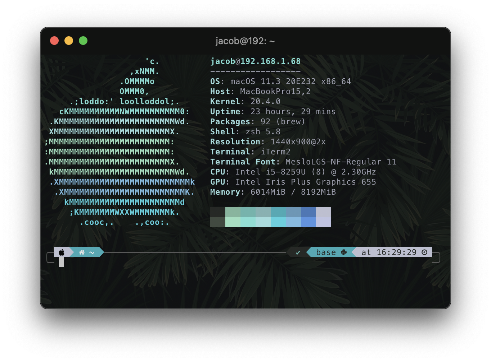

# Jacobs dotfiles


## Setup
|              | Tool   |
| ------------ | ------ |
| Terminal     | Iterm2 |
| Shell        | Zsh    |
| Editor       | Vim    |
| File Manager | Nnn    |

## Instalation

To install this configuration just clone this repo into your home directory and run the install script

```bash
cd ~
git clone https://github.com/JacobKaczmarek/dotfiles
cd dotfiles
chmod +x symlink.sh && ./symlink.sh
```

